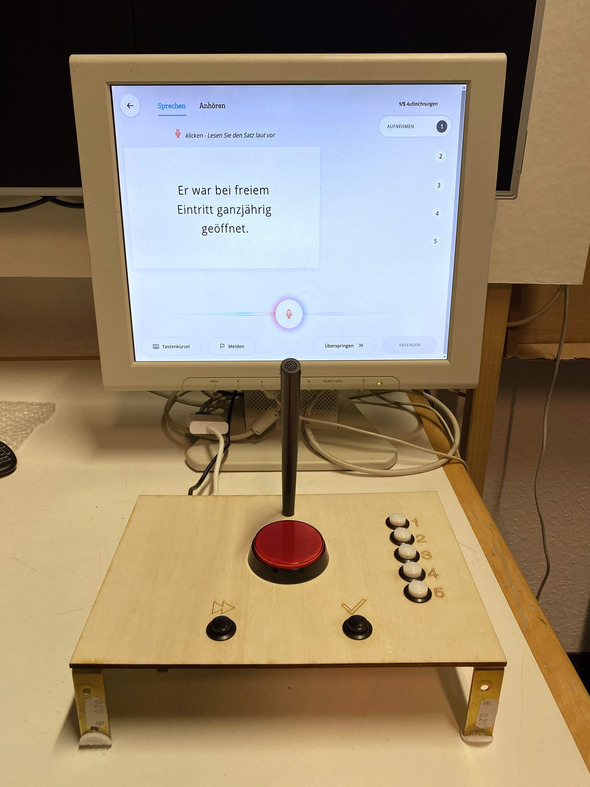
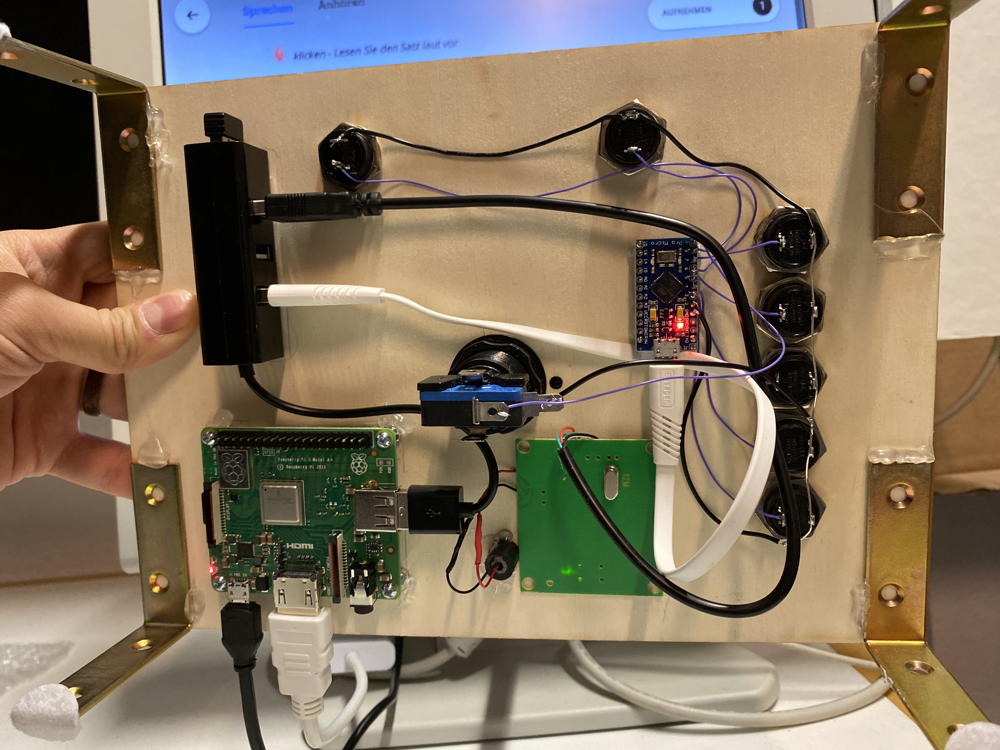

The idea of the project is to build a easy to use console for using [mozilla common voice](https://voice.mozilla.org/). Based on an arduino project, which emulates a keyboard for the common voice keyboard-shortcuts. So the website is completly controlled by the self made keybord.

The current arduino project is configured for german version of the website, but can adjusted for other languages by changing the keys in `chars` and adjusting the pins `keyPins`. For non english keyboard keys use the `ü` as an example.